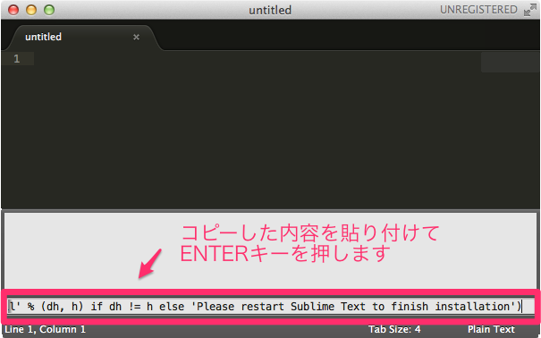

# Sublime Text

Sublime Textはプログラムを書くのに適したエディタです。無料で利用できます。

[http://www.sublimetext.com/](http://www.sublimetext.com/)


## Sublime Text で 試し書き

インストールしたSublime Textを開いて次のプログラムを記述します。

> プログラムを記述し始める前に、ファイル名をsample.htmlとして保存してください。保存先はデスクトップなど任意のフォルダで構いません。

```
<!DOCTYPE html>
<html>
<head>
	<title>IT CARET</title>
</head>
<body>
	<h1>IT CARET</h1>
	
</body>
</html>
```


## パッケージ管理機能を有効にする

Sublime Textにはパッケージ管理（Package Control）という仕組みがあります。パッケージ管理を有効にすれば、簡単に機能を追加することができます。まずはパッケージ管理機能を有効にしておきましょう。

以下のサイトを参考にパッケージ管理機能を有効にします（手順は後述します）。

[https://packagecontrol.io/installation#st2](https://packagecontrol.io/installation#st2)


上記のサイトを開いて、表示されている「import urllib2〜installation')」までをコピーします。


次に、Sublime Textの画面上のメニューからView > Show Consoleを選択して、画面下部に表示された入力エリアにコピーした内容を貼付けてENTERキーを押します。



数秒すると、パッケージ管理機能のインストールは完了します。インストール後、Sublime Textを再起動するとパッケージ管理機能が有効になります。

> インストールしたらSublime Textを再起動します。

## パッケージを追加するには

パッケージの追加については以下のリンク先を参考にしてください。

+ [Emmetパッケージのインストール](https://github.com/murayama333/pg_docs/blob/master/editor/02sublime_emmet.md)
+ [IME Supportパッケージのインストール（Windowsのみ）](https://github.com/murayama333/pg_docs/blob/master/editor/03sublime_ime.md)
