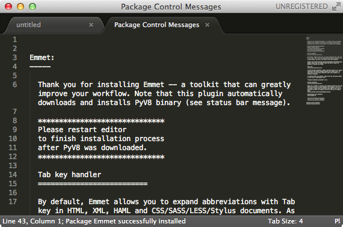

## Emmetパッケージのインストール

EmmetパッケージはHTMLの入力をサポートするパッケージです。

Sublime Textのメニューから[Tools]->[Command Palette]を選択します。表示された小画面で package と入力し、「Package Control Install Package」を選択します。

数秒するとパッケージ選択用の小画面が表示されます。画面が表示されたら「Emmet」と入力し「Emmet」パッケージをインストールします。

インストールは数秒で完了します。インストールが完了すると次のような画面が表示されるでしょう。

 
> インストール完了画面は不要なので、閉じておいてください。

## Emmetの使い方

Emmetの使い方は簡単です。HTMLコードの入力を補完したいところでTABキーを押すだけです。それでは実際に試してみましょう。まずファイルをsample.htmlのようにHTMLファイルとして保存します。

ファイルを保存したら、Sublime Text上で ! と入力してみます。

!の後ろにカーソルがある状態でTABキーを押します。すると次のようにHTMLの雛形が自動で挿入されます。

続いて&lt;body&gt;タグの中にh1と入力してみましょう。

h1の後ろにカーソルがある状態でTABキーを押します。すると次のように&lt;h1&gt;タグが挿入されます。

> Emmetには他にも便利な入力サポートがあります。Googleで「Sublime Emmet」のようなキーワードを検索してみてください。

