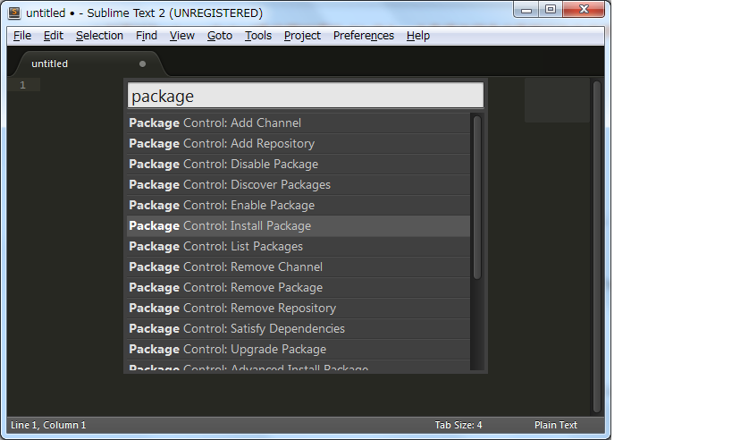
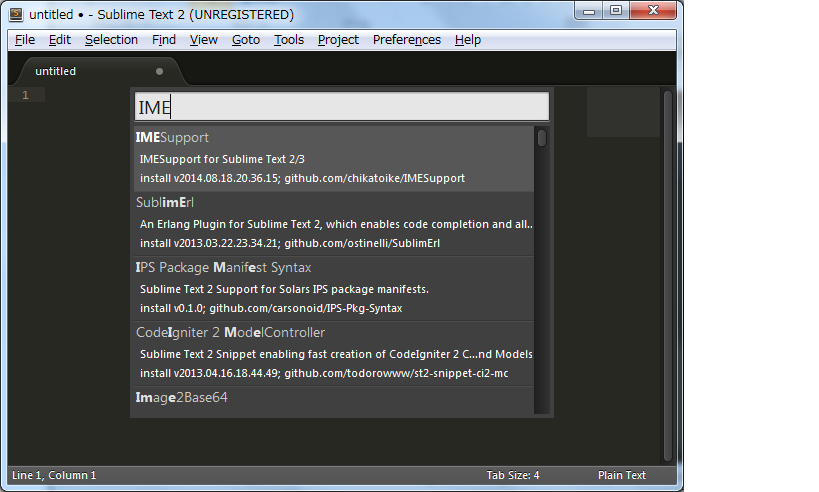

## IME Supportパッケージのインストール（Windowsのみ）

IME Supportパッケージは日本語のインライン入力をサポートするパッケージです。

Sublime Textのメニューから[Tools]->[Command Palette]を選択します。表示された小画面で package と入力し、「Package Control Install Package」を選択します。

数秒するとパッケージ選択用の小画面が表示されます。画面が表示されたら「IME」と入力し「IME Support」パッケージをインストールします。

インストールは数秒で完了します。
 
> インストール完了後、Sublime Textを再起動すると日本語のインライン入力が可能となります。

